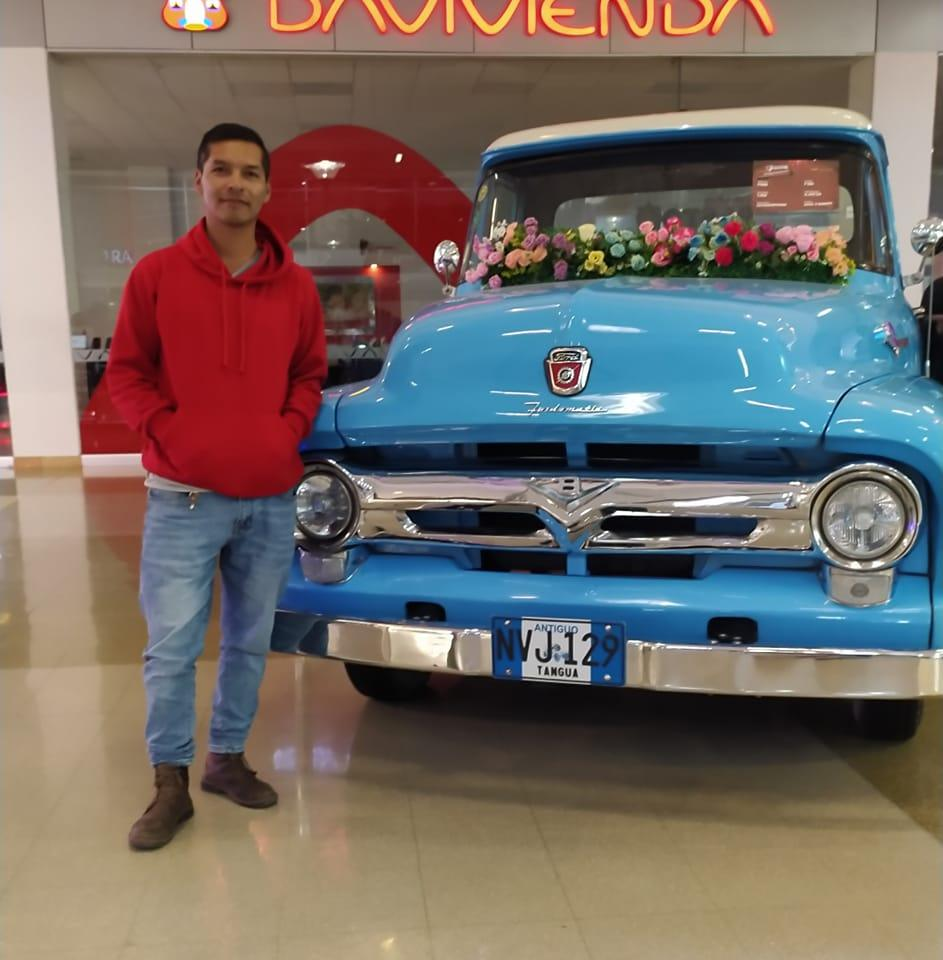

## **Elianis Manuel Medina**
> **Level Designer** | Estudiante de Ingeniería Multimedia (UNAD)

📍 **Ubicación:** Cali, Valle del Cauca  
🎂 **Edad:** 39 años  
🎮 **Proyecto actual:** Desarrollo de mi primer videojuego  

### 💡 Intereses

`Programación` • `Diseño de Niveles` • `Fotografía` • `Animación`

# proyectoJuegoUNAD

## Jhon

**Nombre:** Jhon  
**Rol:** Game Programmer  
**Ubicación:** Ipiales, Nariño, Colombia

### Perfil

Estudiante interesado en el desarrollo de videojuegos y la programación.

Como Game Programmer, me interesa transformar las ideas y diseños del juego
en funcionalidades mediante código, trabajando en la implementación de las
mecánicas, sistemas e interacciones del videojuego.

## **Geordany Giraldo Arenas**
**Ubicacion** Palmira valle
**Edad** 31 Años
**Mi rol** Game designer

# proyectoJuegoUNAD
proyectoJuegoUNAD

## **Geordany Giraldo Arenas**
**Ubicacion** Palmira valle
**Edad** 31 Años
**Mi rol** Game designer