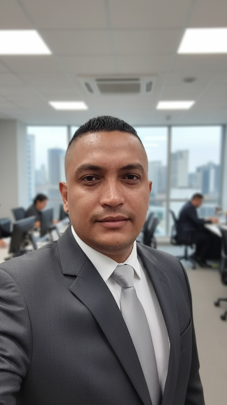

# proyectoJuegoUNAD

## Elianis Manuel Medina

> **Level Designer** | Estudiante de Ingeniería Multimedia (UNAD)

📍 **Ubicación:** Cali, Valle del Cauca  
🎂 **Edad:** 39 años  
🎮 **Proyecto actual:** Desarrollo de mi primer videojuego  

### 💡 Intereses
`Programación` • `Diseño de Niveles` • `Fotografía` • `Animación`

---

## Jhon

**Nombre:** Jhon  
**Rol:** Game Programmer  
**Ubicación:** Ipiales, Nariño, Colombia  

### Perfil
Estudiante interesado en el desarrollo de videojuegos y la programación.

Como Game Programmer, me interesa transformar las ideas y diseños del juego en funcionalidades mediante código, trabajando en la implementación de las mecánicas, sistemas e interacciones del videojuego.

---

## Geordany Giraldo Arenas

**Nombre:** Geordany Giraldo Arenas  
**Rol:** Game Designer  
**Ubicación:** Palmira, Valle del Cauca  
**Edad:** 31 Años  

---

## Edisson Barbosa

**Nombre:** Edisson Barbosa  
**Rol:** Ing. / Game Developer  
**Ubicación:** Cali, Colombia  

### Perfil
Soy Edisson Barbosa, estudiante de ingeniería multimedia. Actualmente estoy fortaleciendo mis conocimientos y habilidades en el área de desarrollo de videojuegos. Mi objetivo es continuar desarrollando competencias que me permitan participar en la creación de soluciones tecnológicas e interactivas.